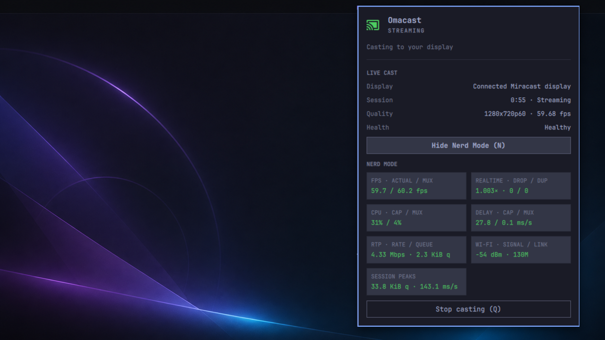

# Omacast



Omacast mirrors an Omarchy/Hyprland desktop and its audio to a Miracast
display. It is keyboard-first, runs from the Omarchy bar, and has been validated
with a stock Fire TV Stick in **Display Mirroring** mode.

```text
Super+Alt+C  →  choose a TV  →  Enter
```

## Features

- Direct Wi-Fi Display casting with no cloud service or receiver app.
- A receiver-tested 1280×720 at 60 fps profile with audio.
- Nearby receiver discovery using the advertised Wi-Fi Display sink role.
- Clear idle, connecting, streaming, and recovery states in the bar.
- Optional Nerd Mode with frame rate, load, RTP, queue, radio, and timing data.
- Supervised sessions that restore temporary networking changes after Stop or
  failure.
- Casting continues until stopped and inhibits idle/sleep while active.
- Passwordless per-cast setup after the companion package installs its narrow,
  `prepare`-only Polkit action.

## Requirements

- Omarchy 4 with Hyprland.
- A VAAPI-capable H.264 encoder.
- A Wi-Fi adapter with Wi-Fi Direct/P2P support.
- A Miracast receiver. Fire TV Stick is the currently validated target; other
  correctly advertising WFD sinks are discoverable but not yet broadly
  hardware-validated.

Broad receiver and hardware support is not claimed yet. Omacast currently
ships desktop mirroring only; window casting and alternate quality modes are
not part of version 0.1.5.

## Install on Omarchy

Omacast has two parts: the bar plugin and an Arch companion package containing
the pinned FluxCast engine and guarded networking helper.

Download the package and `SHA256SUMS` from the
[v0.1.5 release](https://github.com/hardiepiennar/omacast/releases/tag/v0.1.5),
then verify and install it:

```bash
sha256sum --check SHA256SUMS
gh attestation verify fluxcast-omarchy-cast-*.pkg.tar.zst --repo hardiepiennar/omacast
sudo pacman -U ./fluxcast-omarchy-cast-*.pkg.tar.zst
```

Install and enable the plugin:

```bash
omarchy plugin add https://github.com/hardiepiennar/omacast --enable
```

### Bind Super+Alt+C

Add the following to `~/.config/hypr/bindings.lua`:

```lua
o.bind("SUPER + ALT + C", "Cast desktop", "omarchy-shell shell toggle hardie.omarchy-cast")
```

This leaves Omarchy's stock **Super+C** Universal Copy shortcut intact.

Reload Hyprland:

```bash
hyprctl reload
hyprctl configerrors
```

The bar icon works without this optional keybinding.

## Use

1. Put the TV in **Display Mirroring** mode.
2. Press **Super+Alt+C** or click the Omacast bar icon.
3. Choose the TV with **↑/↓** and press **Enter**, or click it.
4. Press **N** for Nerd Mode, **Q** to cancel or stop, and **R** to rescan when
   idle.

Mirroring exposes everything visible on the selected display, including
notifications. Omacast does not bypass DRM; protected browser video may appear
black depending on the browser and service.

## Remove

Stop any cast, then remove the plugin and companion package:

```bash
omarchy plugin remove hardie.omarchy-cast
sudo pacman -Rns fluxcast-omarchy-cast
```

Remove the optional Super+Alt+C binding manually if you added it. Omacast
retains a bounded local diagnostic history after uninstall. To move that
history and old preferences to the desktop Trash:

```bash
gio trash ~/.config/omarchy-cast ~/.local/state/omarchy-cast
```

## Development

Build the companion package from a trusted clone with:

```bash
cd packaging/arch
makepkg -si
```

Run the local checks with:

```bash
scripts/test
scripts/validate-plugin
bin/omacast doctor
bin/omacast media-probe --profile safe
```

See [architecture and roadmap](docs/architecture-and-roadmap.md), the
[research log](docs/research-log.md), and the
[FluxCast patch stack](patches/README.md) for implementation and acceptance
details.

The local authorization and developer-tool trust boundaries are documented in
[SECURITY.md](SECURITY.md).

## Development disclosure

Omacast was developed through a human-directed, AI-assisted process using
OpenAI GPT-5.6 Sol. Product decisions, release authorization, and receiver
acceptance were performed by the maintainer. This does not imply endorsement,
certification, or support by OpenAI.

## License

Omacast and its tracked FluxCast modifications are licensed under
GPL-3.0-or-later.
